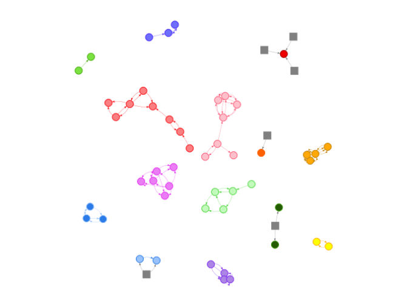

# Objetivo

A intenção deste pacote é de disponibilizar um conjunto de funções que implementam procedimentos analíticos e de mineração de dados que se propõem a subsidiar análises voltadas para a atividade de Controle Externo Governamental.

No momento os seguintes procedimentos estão disponíveis:

* **Práticas colusivas em licitações:** Têm por objetivo identificar situações suspeitas de prática de ação colusiva em procedimentos licitatórios. As funcões disponibilizadas pelo pacote relacionadas a este tema são:
    + `rodizioIdentificaSituacoesSuspeitas`;
    + `plot.TipologiaRodizio`; e
    + `print.TipologiaRodizio`.
  
## Caso de uso 1: aplicação na identificação de práticas colusivas em licitações 

A seguir será demonstrada, passo a passo, uma aplicação na identificação de práticas colusivas em licitações, numa base de dados fornecida juntamente com o pacote \code{RcextTools}

### Considerações Preliminares

Juntamente com o pacote, são fornecidos dados de licitações ocorridas entre 2011 e 2015. Tais dados tiveram alguns campos "embaralhados" de maneira que dados que pudessem identificar os órgaos e empresas participantes não fossem revelados:

* **contratos**: Dados de contratos relativos a base de licitacoes realizadas por orgaos de um ente federativo brasileiro no periodo de 2011 a 2015
* **licitacoes**: Dados de licitacoes realizadas por orgaos de um ente federativo brasileiro no periodo de 2011 a 2015
* **part_lic**: Dados relatvos aos participantes de licitacoes realizadas por orgaos de um ente federativo brasileiro no periodo de 2011 a 2015

O código abaixo, quando executado, exibirá uma breve descrição das bases de dados forncidas juntamente com o pacote `RcextTools`.

```{r, eval=FALSE}
data(package = 'RcextTools')
```

### Inicialmente é preciso criar um `data.frame` de acordo com o *layout* esperado.
```{r}
# carrega o pacote RcextTools
library(RcextTools)

# veja o layout esperado assim: ?rcextRiscoAcaoColusiva

# carrega dados de licitacoes da base fornecida pelo pacote RcextTools
data("part_lic")

dtDados <- part_lic[!is.na(part_lic$COD_LICITACAO),]

dtDados <- data.frame(
  CNPJ = dtDados$CNPJCPF_FORNECEDORES,
  ID_LICITACAO = dtDados$COD_LICITACAO,
  ID_ITEM = dtDados$ID_ITEM,
  VENCEDOR = ifelse(dtDados$VENCEDOR == 'S', T, F),
  VALOR_ESTIMADO = NA,
  VALOR_HOMOLOGADO = as.numeric(dtDados$VALOR_FINAL),
  DESC_OBJETO = dtDados$RESUMO_OBJETO,
  stringsAsFactors = F
)

casosSuspeitos <- TipologiaRodizio(dtDados)
```

### Exibição dos casos suspeitos

#### Grafo representando as empresas suspeitas de prática colusiva

Os diferentes agrupamentos representam empresas suspeitas de praticarem alguma ação colusiva num determinado mercado. Cada agrupamento é representado por uma cor diferente. As arestas apontam no sentido de um perdedor para um vencedor de licitação. Empresas que são sempre perdedoras, não tendo sido vencedoras de nenhuma licitação no período analisado, são representadas por quadrados cinzas.
```{r, eval=FALSE}
plot(casosSuspeitos)

```





#### Relação de contratos suspeitos
```{r}
resultados <- casosSuspeitos$tabela
resultados <- unique(within(resultados, rm(list = c('VALOR_ESTIMADO', 'VENCEDOR', 'VALOR_HOMOLOGADO', 'ID_ITEM'))))
names(resultados)[names(resultados)=="TEXTO_VALOR_HOMOLOGADO"] <- "VALOR"

knitr::kable(resultados)
```

